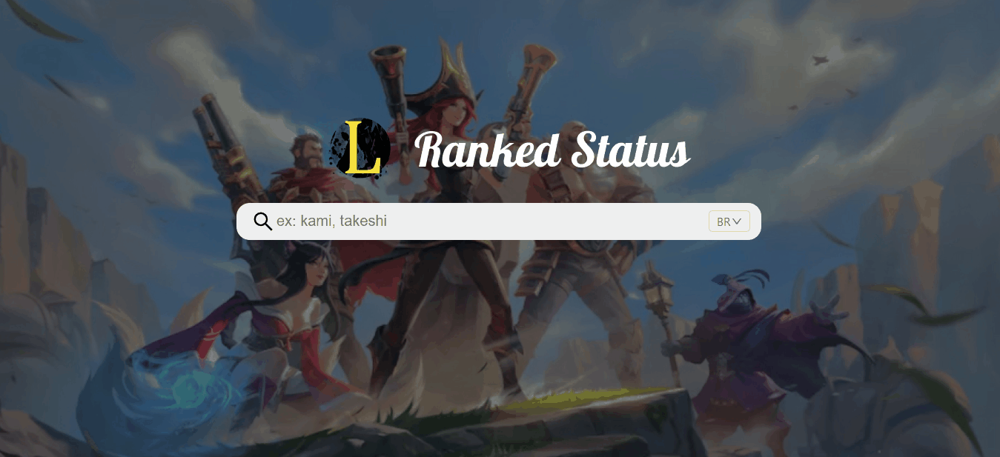

# Ranked status




> web app para ver informação das filas ranqueadas de um jogador de league of legends


## 💻 Pré-requisitos

* Nodejs


## 🚀 Instalando <Ranked status>


BackEnd:
```
cd lolStatus-backEnd
npm i
npm run dev
```
front end:

```
cd lolStatus-frontEnd
npm i 
npm start
```

trocar os arquivos `.env.examples` para`.env` e colocar as chaves necessária para rodar o app em ambos os repositórios.


